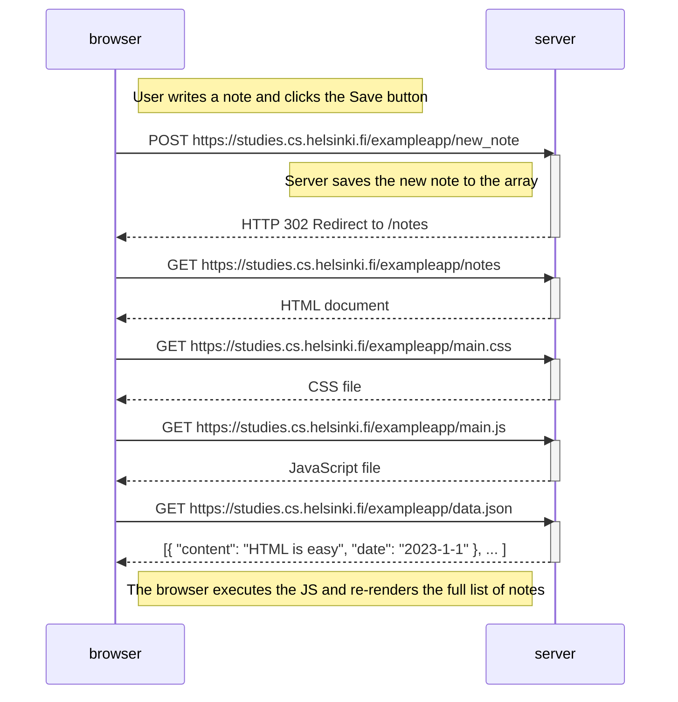
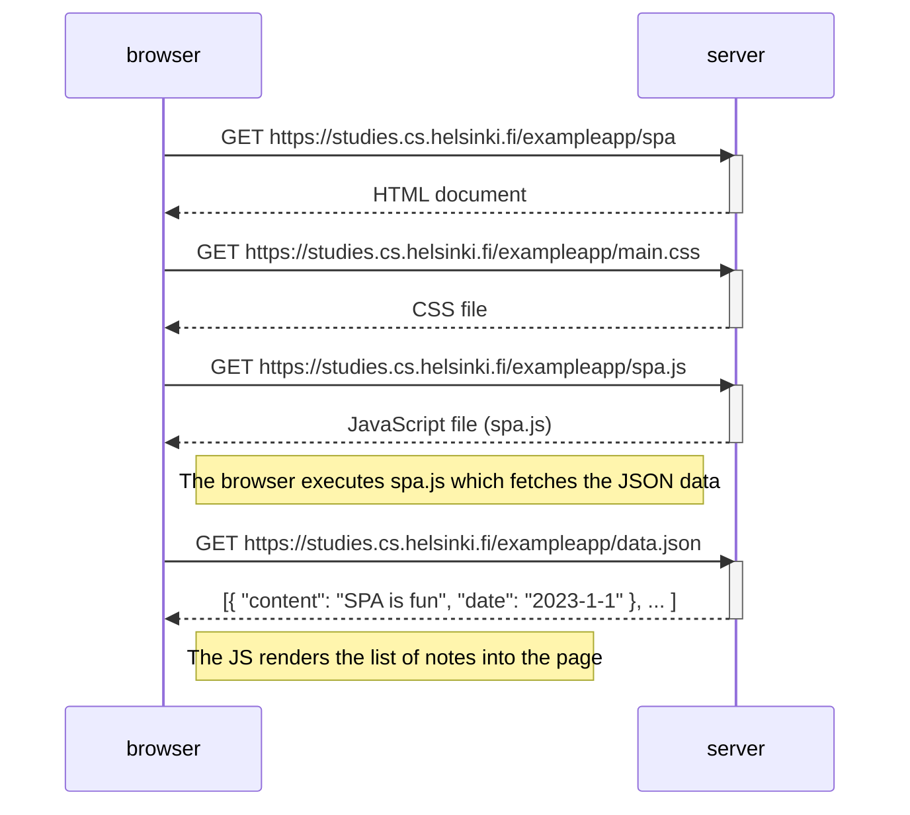
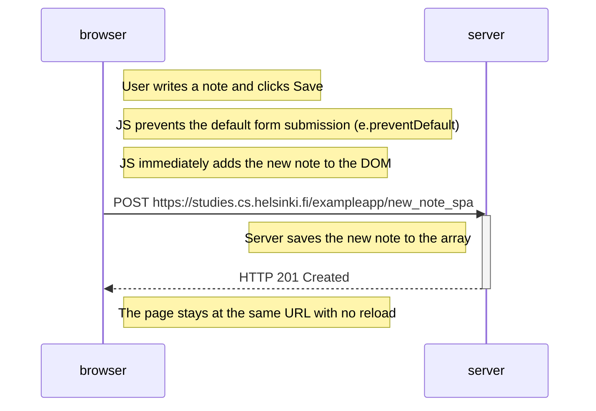

# Full Stack Open - Part 0 Exercises

## 0.4: New Note Diagram

The diagram below depicts the HTTP communication flow when a user creates a new note in the traditional app.

## 0.5: Single Page App Diagram

The diagram below depicts the flow when a user opens the Single Page App (SPA) version of the notes app.

## 0.6: New Note in Single Page App Diagram

The diagram below depicts the flow when a user creates a new note in the SPA version of the app.

